<!-- HEADER ANIMATION -->
<p align="center">
  
</p>

<!-- HOW IT WORKS ANIMATION -->
<p align="center">
  
</p>

<p align="center">
  <a href="https://pypi.org/project/graphruntime/">
    
  </a>
  <a href="https://pypi.org/project/graphruntime/">
    
  </a>
  <a href="https://pypi.org/project/graphruntime/">
    
  </a>
  <a href="https://github.com/tryboy869/graphruntime/blob/main/LICENSE">
    
  </a>
  <a href="https://github.com/tryboy869/graphruntime/stargazers">
    
  </a>
  <a href="https://github.com/tryboy869/graphruntime/actions">
    
  </a>
  
  <a href="https://github.com/tryboy869/graphruntime/issues">
    
  </a>
</p>

---


<p align="center">
  <a href="https://pypi.org/project/graphruntime/">
    
  </a>
  <a href="https://pypi.org/project/graphruntime/">
    
  </a>
  <a href="https://pypi.org/project/graphruntime/">
    
  </a>
  <a href="https://github.com/tryboy869/graphruntime/blob/main/LICENSE">
    
  </a>
  <a href="https://github.com/tryboy869/graphruntime/stargazers">
    
  </a>
  <a href="https://github.com/tryboy869/graphruntime/actions">
    
  </a>
  
  <a href="https://github.com/tryboy869/graphruntime/issues">
    
  </a>
</p>

---

## What is GraphRuntime?

**GraphRuntime** extracts the architectural graph of any software project or package, enables LLMs to reason on that graph, and generates a `runtime.json` that connects, modifies, or fuses multiple systems — in any language.

```bash
pip install graphruntime
```

---

## The 4 Universal Questions

Every file in every project answers 4 questions:

```
→ What enters this file?      (imports, dependencies)
→ What exits this file?       (classes, functions, exports)
→ What does it call?          (internal dependencies)
→ Who calls it?               (inferred by graph inversion)
```

These 4 questions work on Python, TypeScript, Rust, Go, Java, C++, Terraform, SQL, GraphQL — **42 languages supported.**

---

## Quick Start

```bash
# Extract graph from a local repo
graphruntime extract ./my-project

# Pull a pre-analyzed graph from the registry
graphruntime pull flask
graphruntime pull numpy

# Inspect an architecture
graphruntime inspect graph.json

# Merge two architectures with an objective
graphruntime merge graph_flask.json graph_numpy.json \
  --objective "REST API that processes dataframes"

# Execute a runtime
graphruntime run runtime.json

# Let the AI choose everything
graphruntime goal "I want an API that transcribes audio files to PDF"
```

---

## CLI Commands

| Command | Description |
|---|---|
| `extract <source>` | Extract graph from local path, GitHub, PyPI, npm, cargo |
| `pull <package>` | Pull pre-analyzed graph from registry |
| `inspect <graph>` | Human-readable architecture summary |
| `diff <graph_a> <graph_b>` | Architectural diff between two versions |
| `modify <repo>` | Modify existing repo guided by graph |
| `create <repo>` | Create missing files identified by graph |
| `rewire <repo>` | Invert or reroute data flow between modules |
| `merge <a> <b>` | Fuse two architectures into a runtime |
| `run <runtime>` | Execute a runtime.json |
| `watch <repo>` | Live graph rebuild on file changes |
| `explain <graph>` | LLM explains the architecture |
| `validate <repo>` | Validate architectural integrity |
| `goal "<objective>"` | AI selects libs, builds and runs everything |
| `publish <graph>` | Contribute a graph to the registry |

---

## Supported Sources

```bash
graphruntime extract ./local-path
graphruntime extract github:user/repo
graphruntime extract pip:flask
graphruntime extract npm:react
graphruntime extract cargo:tokio
graphruntime extract go:gin-gonic/gin
```

---

## LLM Providers

```bash
graphruntime config set provider groq      # default
graphruntime config set provider openai
graphruntime config set provider anthropic
graphruntime config set provider ollama    # local
```

---

## Registry

The GraphRuntime Registry contains pre-analyzed `graph.json` files for the most critical packages in the world. Browse at `registry/` or pull directly:

```bash
graphruntime pull pandas
graphruntime pull kubernetes
graphruntime pull react
```

Contribute a new graph:
```bash
graphruntime publish my_graph.json --package mypackage --version 1.0.0
```

---

## SKILL.md for AI Agents

Any LLM or AI agent can understand and pilot GraphRuntime by reading [`SKILL.md`](SKILL.md).

---

## Contributors

<p align="center">
  
</p>

---

## License

MIT © GraphRuntime Contributors

<p align="center">
  
</p>
